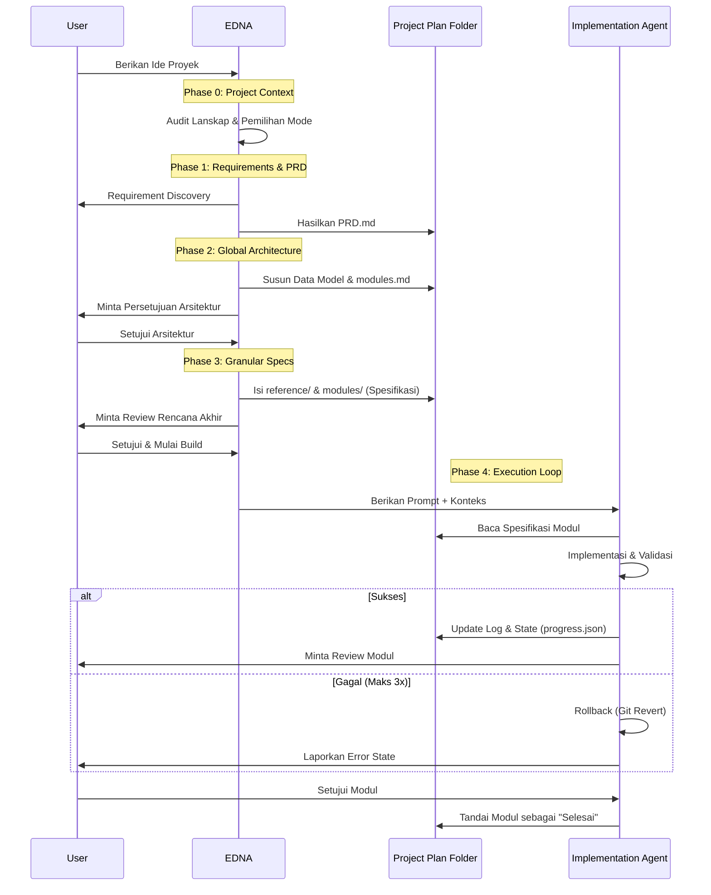

# Cara Kerja: Agent EDNA
## *Dokumentasi Teknis: Software Context Engineering*

---

### Manajemen Jendela Konteks (Context Window)
Performa LLM sangat bergantung pada kualitas dan fidelitas konteks yang diberikan. Agent EDNA menangani batasan teknis secara spesifik:

*   **Batasan Jendela Konteks**
    Setiap LLM memiliki kapasitas token yang terbatas. Akurasi akan menurun secara signifikan ketika jendela konteks mendekati ambang batas maksimal, yang sering mengakibatkan efek **"Lost in the Middle"** — di mana model mulai mengabaikan instruksi krusial.
*   **Akurasi dan Halusinasi**
    Dalam siklus pengembangan yang panjang, model rentan kehilangan jejak batasan arsitektur awal. Hal ini memicu terjadinya **halusinasi** teknis, di mana AI menghasilkan kode yang bertentangan dengan *global state* yang telah ditetapkan.
*   **Isolasi Modular (Feature-First Architecture)**
    EDNA beroperasi sebagai **AI Skill** modular yang menerapkan **Feature-Driven Modularization**. Setiap modul mewakili fitur utuh yang terintegrasi (Desain + Logika). 
    > **Rasional:** Pengembangan berbasis lapisan (*layer-based*) sering kali menimbulkan **"Dummy Debt"**, di mana komponen UI terputus dari logika backend. 
    >
    > **Integrasi Fullstack:** Dengan menyajikan desain dan logika secara simultan, EDNA memastikan komponen berfungsi sejak awal, guna mencegah **"Silo Effect"** — kondisi di mana pengembang hanya terfokus pada lapisan yang terisolasi.
*   **Eksekusi Berbasis Dependensi**
    Modul dieksekusi berdasarkan urutan dependensi yang ketat. Sebuah fitur baru dianggap **"Selesai"** (Done) hanya jika desain, frontend, dan integrasi backend telah diverifikasi secara kolektif.

---

### Arsitektur Integrasi Client-Skill
Agent EDNA beroperasi sebagai **AI Skill** standar, mengikuti siklus hidup penemuan (*discovery*), pencocokan semantik, dan eksekusi di dalam host agent (Claude Code, Gemini CLI, dsb).

#### **Discovery & Indexing**
Saat inisiasi, host agent akan memindai direktori yang telah ditentukan. Ia mem-parsing **YAML frontmatter** pada `SKILL.md` untuk mengindeks:
*   **Skill Identity:** Nama internal (`edna`).
*   **Activation Triggers:** Kata kunci deskriptif untuk *semantic matching*.
*   **Tool Manifest:** Deklarasi alat sistem yang diizinkan (misal: `Read`, `Write`, `Bash`).

#### **Execution Lifecycle**
1.  **Semantic Triggering:** Ketika input pengguna selaras dengan deskripsi skill, host agent memuat seluruh instruksi dari `SKILL.md` ke dalam konteks aktif.
2.  **Context Isolation:** Guna mencegah *token bloat*, EDNA menggunakan metode *modular reference splitting*:
    > **Reference Splitting:** Memisahkan instruksi spesifik fase ke dalam direktori `references/`. Host agent hanya memuat metadata inti saat startup.
    >
    > **On-Demand Context:** Detail fase dan template hanya akan dimuat saat relevan dengan tugas yang sedang dikerjakan. Metode ini secara signifikan menekan konsumsi token dasar.
3.  **Permission Handshake:** Host agent memberikan otoritas pada alat sistem yang dideklarasikan, memungkinkan manipulasi filesystem dan terminal secara aman.

---

### Analisis Komparatif: Unmanaged Inference vs. Context Engineering
Membandingkan metode pembuatan kode LLM konvensional (*one-shot prompting*) dengan kerangka kerja *context engineering* yang terkelola.

| Aspek Teknis | One-Shot Prompting | Context-Managed Framework (EDNA) |
|:--- |:--- |:--- |
| **Analisis Input** | Kode dihasilkan langsung dari instruksi bahasa alami yang ambigu. | Ekstraksi batasan implisit secara terstruktur sebelum tahap implementasi. |
| **Verifikasi Logika** | Mengandalkan probabilitas model; rentan terhadap inkonsistensi logika. | Menegakkan **Binary Validation Criteria** guna menjamin output yang deterministik. |
| **Manajemen Konteks** | Mencampuradukkan banyak lapisan dalam satu putaran, mempercepat degradasi konteks. | Menggunakan **Feature-Driven Modularization** untuk menjaga fokus jendela konteks per tugas. |
| **Strategi Pemulihan** | Penambalan (*patching*) kesalahan secara heuristik yang memperluas utang teknis. | Menerapkan **Limit 3 Percobaan** diikuti otomatisasi **Git Rollback** ke *state* terakhir yang valid. |
| **Persistensi State** | Bersifat sementara (*transient*); bergantung sepenuhnya pada riwayat sesi. | Bersifat persisten; menggunakan `progress.json` dan `decisions.md` (ADR) untuk menjaga kontinuitas antar sesi. |

---

### Fase Implementasi

#### **Requirement Discovery**
EDNA menggunakan proses penemuan sistematis untuk mengekstrak persyaratan teknis. File `PRD.md` yang dihasilkan berfungsi sebagai **spesifikasi teknis** utama (*Single Source of Truth*).

#### **Phase 2: Global Architecture**
*   **Storage-Agnostic Modeling:** Entitas data didefinisikan berdasarkan relasi dan tipe field. Detail implementasi ditangguhkan demi menjaga independensi logika inti (*decoupled*).
*   **Risk Analysis:** Identifikasi dependensi kritis dan mitigasi potensi kegagalan beruntun (*cascading failures*) pada seluruh grafik modul.

#### **Phase 3: Module Specification**
Modul didefinisikan dengan cakupan yang terukur. Setiap spesifikasi mencakup **Kriteria Lulus/Gagal Biner** untuk validasi yang objektif.

#### **Phase 4: Execution Loop**
EDNA menyusun `agent_prompt.md` yang memandu tahap implementasi. Kerangka kerja ini menegakkan tinjauan dependensi dan **validation gates** otomatis (linting, type-checking, dan security scan).

---

### Alur Kerja Operasional (Workflow)

---

### 🛠️ Direktif Strategis
*   **Presisi pada Persyaratan.**
*   **Isolasi melalui Modularitas.**
*   **Finalitas Berbasis Validasi.**
