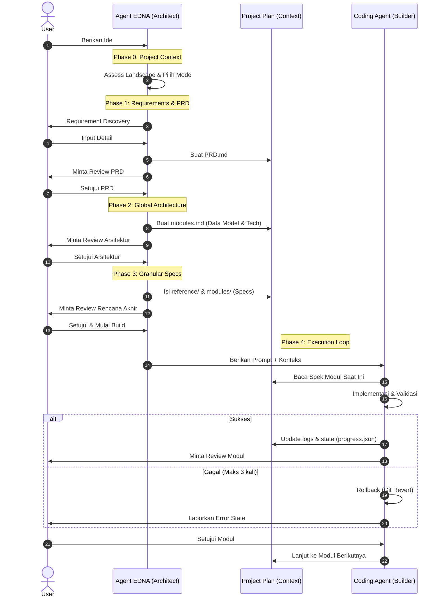

# Cara Kerja: Agent EDNA
## *Technical Documentation: Software Context Engineering*

---

### Context Window Management
Performa LLM sangat bergantung pada kualitas dan fidelitas konteks yang diberikan. Agent EDNA menangani batasan teknis yang spesifik:

*   **Context Window Limitations**
    LLM memiliki batasan token yang finit. Akurasi menurun saat jendela konteks (window) mencapai kapasitas maksimal, yang sering menyebabkan efek **"Lost in the Middle"** di mana model mengabaikan instruksi kritis.
*   **Accuracy and Hallucination**
    Dalam siklus pengembangan yang panjang, model bisa kehilangan jejak batasan arsitektur awal. Hal ini menyebabkan **hallucinations** di mana AI menghasilkan kode yang bertentangan dengan global state yang telah ditetapkan.
*   **Modular Isolation (Feature-First Skill Architecture)**
    EDNA beroperasi sebagai **AI Skill** yang modular, menegakkan **Feature-Driven Modularization**. Setiap modul mewakili fitur yang lengkap dan terintegrasi (Design + Logic). 
    > **Rasional:** Pengembangan berbasis lapisan (layer-based) sering kali menyebabkan **"Dummy Debt"**, di mana komponen UI tetap terputus dari logika backend. 
    >
    > **Fullstack Integration:** Dengan memberikan desain dan logika secara bersamaan, EDNA memastikan komponen berfungsi sejak awal, mencegah **"silo effect"** di mana pengembang hanya fokus pada lapisan terisolasi.
*   **Dependency-Based Execution**
    Modul dieksekusi dalam urutan (sequence) yang ketat. Sebuah fitur hanya dianggap **"Done"** ketika desain, frontend, dan integrasi backend telah diverifikasi bersama.

---

### Client-Skill Integration Architecture
Agent EDNA beroperasi sebagai **AI Skill** yang standar, mengikuti lifecycle discovery, semantic matching, dan eksekusi di dalam host agent (Claude Code, Gemini CLI, dll.).

#### **Discovery & Indexing**
Saat startup, host agent memindai direktori yang telah ditentukan. Ia mem-parsing **YAML frontmatter** di `SKILL.md` untuk mengindeks:
*   **Skill Identity:** Nama internal (`edna`).
*   **Activation Triggers:** Kata kunci deskriptif yang digunakan untuk semantic matching.
*   **Tool Manifest:** Deklarasi tool sistem yang diizinkan (misal: `read_file`, `write_file`, `run_shell_command`).

#### **Execution Lifecycle**
1.  **Semantic Triggering:** Saat input pengguna cocok dengan deskripsi skill, host agent memuat seluruh set instruksi dari `SKILL.md` ke dalam konteks aktifnya.
2.  **Context Isolation (Skill-Based):** Untuk mencegah token bloat, EDNA menggunakan modular reference splitting:
    > **Reference Splitting:** Dengan memindahkan instruksi spesifik fase ke folder `references/`, agen hanya memuat metadata identitas inti saat startup.
    >
    > **On-Demand Context:** Detail fase lengkap dan template hanya dimuat saat relevan dengan tugas yang sedang dikerjakan. Ini secara signifikan mengurangi baseline token consumption.
3.  **Permission Handshake:** Host agent memberikan akses ke tool sistem yang ditentukan, memungkinkannya memanipulasi filesystem lokal dan terminal.

---

### Analisis Komparatif: Unmanaged Inference vs. Context Engineering
Bagian ini membandingkan pembuatan kode LLM tanpa pengelolaan (one-shot prompting) dengan kerangka kerja context-engineering yang terkelola.

| Technical Aspect | One-Shot Prompting | Context-Managed Framework (EDNA) |
|:--- |:--- |:--- |
| **Input Analysis** | Pembuatan kode langsung dari instruksi bahasa alami yang ambigu. | Ekstraksi terstruktur dari batasan implisit sebelum implementasi. |
| **Logic Verification** | Mengandalkan probabilitas model untuk mengisi celah; rentan terhadap logika yang tidak konsisten. | Menegakkan **Binary Validation Criteria** dalam spesifikasi untuk memastikan output deterministik. |
| **Context Management** | Menggabungkan banyak lapisan dalam satu turn, meningkatkan degradasi konteks. | Menggunakan **Feature-Driven Modularization** untuk menjaga context window tetap fokus per tugas. |
| **Recovery Strategy** | Heuristic patching pada error, yang menyebarkan utang teknis (technical debt). | Menerapkan **3-Attempt Limit** diikuti dengan otomatisasi **Git Rollback** ke keadaan yang terverifikasi. |
| **State Persistence** | Bersifat sementara (transient); bergantung pada riwayat sesi saat itu juga. | Bersifat persisten; menggunakan `progress.json` dan `decisions.md` (ADR) untuk menjaga state antar sesi. |

---

### Fase Implementasi

#### **Requirement Discovery**
EDNA menggunakan discovery yang sistematis untuk mengekstrak persyaratan. File `PRD.md` yang dihasilkan berfungsi sebagai **technical specification** utama.

#### **Phase 2: Global Architecture**
*   **Storage-Agnostic Modeling:** Entitas data didefinisikan berdasarkan hubungan dan tipe field. Detail implementasi ditangguhkan untuk menjaga logika inti tetap terpisah (decoupled).
*   **Risk Analysis:** Identifikasi dependensi kritis dan potensi kegagalan beruntun (cascading failures) di seluruh grafik modul.

#### **Phase 3: Module Specification**
Modul didefinisikan dengan cakupan terbatas (biasanya di bawah 20 file). Setiap spesifikasi mencakup **Binary Pass/Fail Criteria** untuk validasi objektif.

#### **Phase 4: Execution Loop**
EDNA menghasilkan `agent_prompt.md` yang mengarahkan implementasi. Ia menegakkan dependency reviews dan **validation gates** otomatis (linting, type-checking, dan security scans).

---

### Operational Workflow

---

### 🛠️ Direktif Strategis
*   **Precision in Requirements.**
*   **Isolation via Modularity.**
*   **Validation-Driven Finality.**
