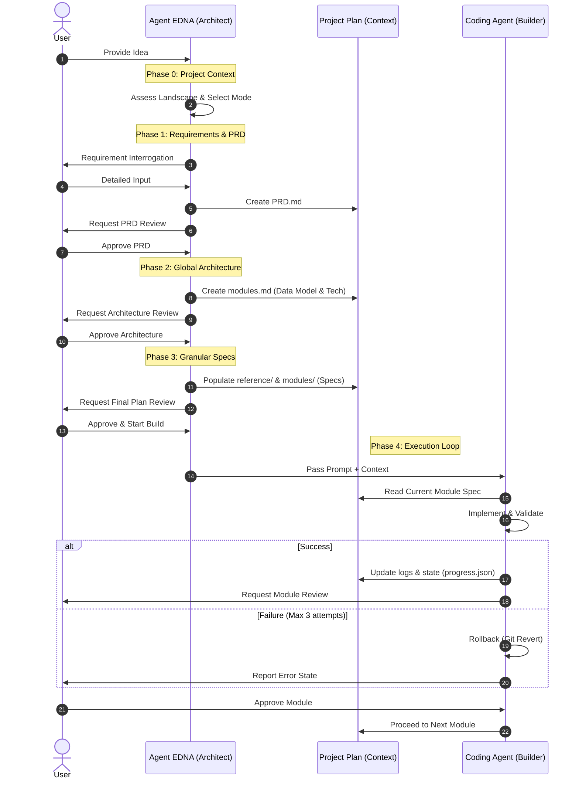

# How It Works: Agent EDNA
## *Technical Documentation: Software Context Engineering*

---

### Context Window Management
LLM performance depends on the quality and volume of the provided context. Agent EDNA addresses specific technical constraints:

*   **Context Window Limitations**
    LLMs have finite token limits. Accuracy decreases as the window reaches capacity, often leading to the **"Lost in the Middle"** effect where critical instructions are ignored.
*   **Accuracy and Hallucination**
    In long-running development cycles, models can lose track of early architectural constraints. This results in **hallucinations** where the AI proposes code that conflicts with the established global state.
*   **Modular Isolation (Feature-First Strategy)**
    Unlike traditional layer-based approaches (Frontend vs. Backend), EDNA enforces **Feature-Driven Modularization**. Each module represents a complete, integrated feature (Design + Logic). 
    > **Rationale:** Layer-based development often leads to **"Dummy Debt,"** where UI mockups remain disconnected from backend logic. 
    >
    > **Fullstack Integration:** By delivering design and logic together, EDNA ensures that components are functional from the start, preventing the **"ego-silo"** effect where developers focus only on their specific layer.
*   **Dependency-Based Execution**
    Modules are executed in a strict dependency sequence. A feature is only considered **"Done"** when the design, frontend, and backend integration are verified together.

---

### Client-Skill Integration Architecture
Agent EDNA operates as a standardized **AI Skill**, following a lifecycle of discovery, semantic matching, and execution within the host agent (Claude Code, Gemini CLI, etc.).

#### **Discovery & Indexing**
Upon startup, the host agent scans predefined directories (e.g., `~/.claude/skills/`). It parses the **YAML frontmatter** in `SKILL.md` to index:
*   **Skill Identity:** The internal name (`edna`).
*   **Activation Triggers:** Descriptive keywords used for semantic matching.
*   **Tool Manifest:** A declaration of allowed system tools (e.g., `read_file`, `write_file`, `run_shell_command`).

#### **Execution Lifecycle**
1.  **Semantic Triggering:** When a user's input matches the skill's description, the host agent loads the full instruction set from `SKILL.md` into its active context.
2.  **Context Isolation (Skill-Based):** To prevent token bloat, EDNA uses modular reference splitting:
    > **Reference Splitting:** By moving phase-specific instructions into the `references/` folder, the agent only loads core identity at startup.
    >
    > **On-Demand Context:** Full phase details and templates are loaded only when relevant to the current task. This significantly reduces baseline token consumption.
3.  **Permission Handshake:** The host agent grants the skill access to the specified tools, allowing it to manipulate the local filesystem and terminal.

---

### Comparative Analysis: Unmanaged Inference vs. Context Engineering
This section contrasts unmanaged LLM generation (one-shot prompting) with managed context engineering.

| Technical Aspect | One-Shot Prompting | Context-Managed Framework (EDNA) |
|:--- |:--- |:--- |
| **Input Analysis** | Direct code generation from natural language instructions. | Structured extraction of constraints prior to coding. |
| **Logic Verification** | Relies on model-internal probability for gap filling; prone to inconsistent logic. | Enforces **Binary Validation Criteria** within module specifications to ensure deterministic output. |
| **Context Management** | Combines multiple layers in a single turn, increasing token entropy. | Uses **Feature-Driven Modularization** to maintain a low-entropy context window per task. |
| **Recovery Strategy** | Heuristic patching of errors, which can propagate technical debt. | Implements a **3-Attempt Limit** followed by an automated **Git Rollback** to a verified state. |
| **State Persistence** | Transient; depends on the immediate session history. | Persistent; uses `progress.json` and `decisions.md` (ADR) to maintain state. |

---

### Implementation Phases

#### **Phase 0 & 1: Requirement Extraction**
EDNA uses structured interrogation to extract requirements. The resulting `PRD.md` serves as the primary **technical specification**.

#### **Phase 2: Global Architecture**
*   **Storage-Agnostic Modeling:** Data entities are defined by relationships and field types. Implementation details are deferred to ensure core logic remains decoupled.
*   **Risk Analysis:** Identification of critical dependencies and potential cascading failures across the module graph.

#### **Phase 3: Module Specification**
Individual modules are defined with a limited scope (typically under 20 files). Each specification includes **Binary Pass/Fail Criteria** for objective validation.

#### **Phase 4: Execution Loop**
EDNA generates an `agent_prompt.md` that directs implementation. It enforces dependency reviews and automated **validation gates** (linting, type-checking, and security scans).

---

### Operational Workflow

---

### 🛠️ Strategic Directives
*   **Precision in Requirements.**
*   **Isolation via Modularity.**
*   **Validation-Driven Finality.**
