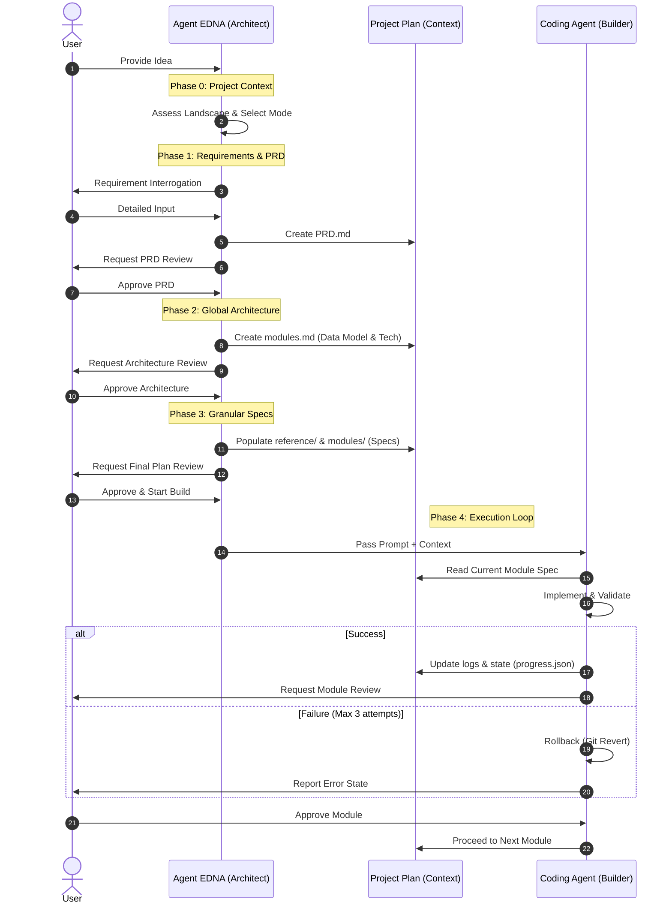

# How It Works: Agent EDNA
## *Technical Documentation: Software Context Engineering*

---

### 1. Context Window Management 🌪️
LLM performance depends on the quality and volume of the provided context. Agent EDNA addresses specific technical constraints:

*   **Context Window Limitations:** LLMs have finite token limits. Accuracy decreases as the window reaches capacity, often leading to the "Lost in the Middle" effect.
*   **Accuracy and Hallucination:** In long-running development cycles, models can lose track of early architectural constraints. This results in hallucinations where the AI proposes code that conflicts with the established global state.
*   **Modular Isolation:** EDNA manages context by enforcing a modular structure. By focusing the model on a single, self-contained module at a time, the framework maintains the active context within high-accuracy ranges.

---

### 2. Implementation Phases 🏛️

#### **Phase 0 & 1: Requirement Extraction**
EDNA uses structured interrogation to extract requirements. The resulting `PRD.md` serves as the primary technical specification, establishing the scope before architecture begins.

#### **Phase 2: Global Architecture**
*   **Storage-Agnostic Modeling:** Data entities are defined by relationships and field types. Implementation details (SQL, NoSQL, etc.) are deferred to ensure the core logic remains decoupled from the storage layer.
*   **Risk Analysis:** Identification of critical dependencies and potential cascading failures across the module graph.

#### **Phase 3: Module Specification**
Individual modules are defined with a limited scope (typically under 20 files). Each specification includes **Binary Pass/Fail Criteria** to provide objective validation during implementation.

#### **Phase 4: Execution Loop**
EDNA generates an `agent_prompt.md` that directs implementation. It enforces:
*   **Dependency Review:** Mandatory analysis of existing modules to ensure architectural consistency.
*   **Validation Gates:** Automated linting, type-checking, and security scans (blocking on critical vulnerabilities).

---

### 3. Operational Workflow 🔄

---

### 4. State Management & Reliability 🛡️

*   **Persistence:** `progress.json` stores the current state of the implementation loop. This allows the system to resume from the last successful module without re-processing the entire project history.
*   **Decision Logging (ADR):** Technical decisions are recorded in `decisions.md` using the Architectural Decision Record format, providing a historical record of technical choices and their rationale.
*   **Modular Containment:** By strictly limiting the scope of each coding task, EDNA ensures that the active context remains within the model's most accurate memory range.
*   **Error Handling:** A 3-attempt limit for automated fixes. Unresolved errors trigger a rollback to the last verified state, preventing the propagation of corrupted code.

---

### 5. Efficiency Principles ✂️

*   **Minimalism:** Removal of unnecessary features ("capes") reduces technical debt and improves system maintainability.
*   **Binary Validation:** Tasks are considered complete only when both automated tests and specific pass/fail criteria are met.
*   **Immutability:** Project plans are read-only during the execution phase to prevent unauthorized architectural drift.

---

### 🛠️ Strategic Directives
*   **Precision in Requirements.**
*   **Isolation via Modularity.**
*   **Validation-Driven Finality.**
