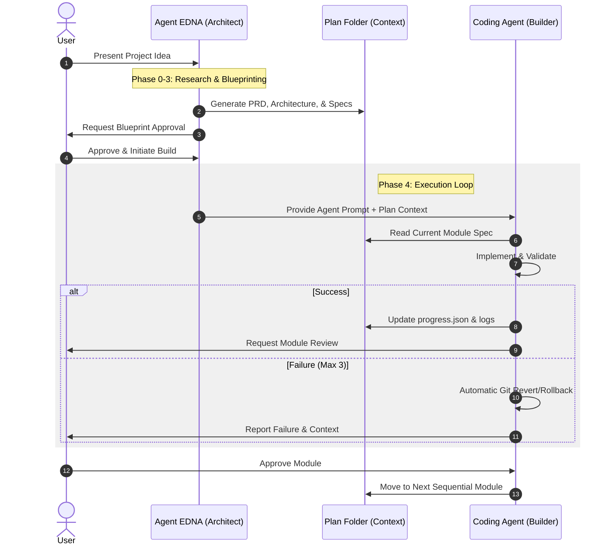

# How It Works: Agent EDNA
## *Framework for High-Fidelity Software Context Engineering*

---

### 1. The Crisis of "Messy Context" 🌪️
*   **The Problem:** Most AI agents fail or hallucinate because they operate within fragmented or poorly structured context windows.
*   **The Symptom:** Scope creep, bloated features ("capes"), and broken dependency chains.
*   **The Solution:** **Agent EDNA.** A systematic framework that engineers the project environment *before* a single line of application code is written.

---

### 2. Why "EDNA"? 👓
The persona of **Edna Mode** (from *The Incredibles*) was chosen to embody three core engineering principles:
1.  **Uncompromising Quality:** Zero tolerance for mediocrity or "good enough" solutions.
2.  **The "No Capes" Philosophy:** A strict mandate to eliminate useless features (bloat) that weigh a project down and introduce technical debt.
3.  **Visual Dominance:** A belief that if logic is too complex to be visualized, it is too complex to be safely implemented.

---

### 3. The 5-Phase Workflow 🏛️
EDNA operates through a rigorous, linear progression to ensure architectural integrity:

1.  **Phase 0: Project Context:** Assessing the landscape, technology constraints, and operational mode (Web, Mobile, CLI, etc.).
2.  **Phase 1: Discovery & PRD:** Distilling requirements into a high-fidelity Product Requirements Document.
3.  **Phase 2: Global Architecture:** Defining the master data model, tech stack, and module orchestration.
4.  **Phase 3: Granular Specification:** Creating self-contained module specs with binary pass/fail criteria.
5.  **Phase 4: Agentic Execution:** Deploying a "Battle-Ready" prompt to a coding agent for iterative implementation.

---

### 4. The Agentic Lifecycle 🔄
*Collaboration flow between User, Architect (EDNA), and the Implementation Agent.*

---

### 5. Technical Advantages 🏆
*   **Resilience:** State is persisted in `progress.json`, allowing for seamless recovery after session interruptions.
*   **Traceability:** Every architectural decision is recorded in `decisions.md` using the ADR (Architectural Decision Record) format.
*   **Binary Validation:** Testing is based on pass/fail checks, removing ambiguity from the "Definition of Done."

---

### 🛠️ Core Directives
*   **Context is Foundation.**
*   **Structure is Security.**
*   **No Capes (Eliminate Bloat).**
