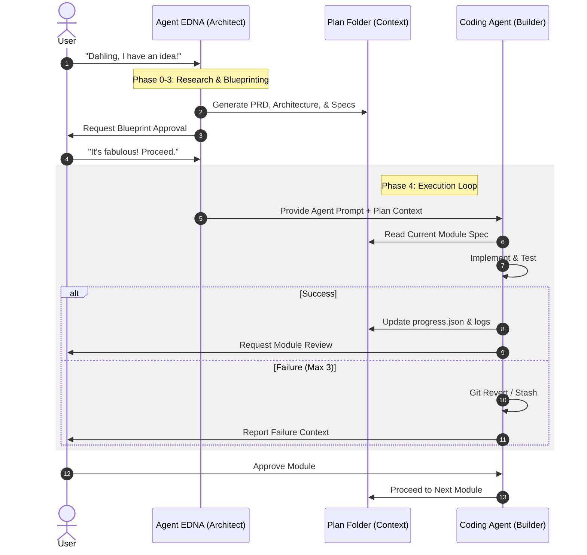

# 🎙️ Presentation: Agent EDNA
## *The Evolution of Software Context Engineering*

---

### 1. The Crisis of "Messy Context" 🌪️
*   **The Problem:** Most AI agents fail because they lack clear, structured context.
*   **The Symptom:** Hallucinations, bloated features ("capes"), and broken dependency chains.
*   **The Solution:** **Agent EDNA.** We don't just prompt; we engineer the environment for success.

---

### 2. The "No Capes" Philosophy ✂️
*   **Excellence > Features:** A little bit different is better than a little bit better.
*   **Precision Interrogation:** We stop the build before it starts if the requirements are vague.
*   **Elimination of Waste:** If a feature weighs the project down without clear ROI, it's a cape. **And we don't do capes.**

---

### 3. The 5-Phase Workflow 🏛️
1.  **Phase 0: Landscape:** Assessing the ground before we dig.
2.  **Phase 1: PRD:** Distilling the "Pain" into a "Solution."
3.  **Phase 2: Global Architecture:** The master data model and orchestration.
4.  **Phase 3: Granular Specs:** Small, testable, binary-pass modules.
5.  **Phase 4: Agentic Execution:** Deploying the "Battle-Ready" prompt.

---

### 4. The Agentic Lifecycle 🔄
*How User, EDNA (Architect), and the Coding Agent interact.*

---

### 5. Why We Win 🏆
*   **Resilience:** We can crash and resume without losing a single line of progress.
*   **Traceability:** Every decision is logged in `decisions.md` (ADR format).
*   **Quality Gate:** Binary acceptance criteria ensure "Done" actually means "Done."

> *"Dahling, luck favors the prepared."*

---

### 🛠️ Key Takeaways
*   **Context is King.**
*   **Structure is Queen.**
*   **No. Capes.**
