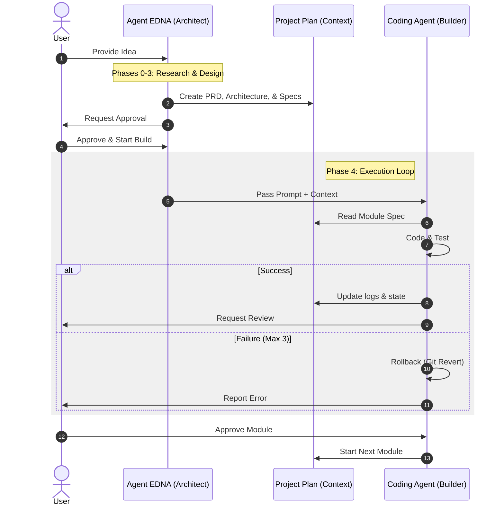

# How It Works: Agent EDNA
## *Framework for High-Quality Software Context Engineering*

---

### 1. The Problem: "Messy Context" 🌪️
*   **The Problem:** LLMs need accurate context to work well, but they have a limited **Context Window**.
*   **The Technical Challenge:** Large projects exceed these limits. Too much data or bad compression causes **"Context Amnesia,"** leading to AI **Hallucinations**.
*   **The Results:** Bloated features ("capes") and broken code because the AI loses track of the big picture.
*   **The Solution:** **Agent EDNA.** She organizes the project *before* coding. By breaking tasks into small, clear modules, she keeps the AI accurate.

---

### 2. Why "EDNA"? 👓
The **Edna Mode** persona represents three engineering principles:
1.  **Top Quality:** No "good enough" shortcuts.
2.  **No Capes:** Remove useless features (bloat) that slow down the project.
3.  **Visual First:** If logic is too complex to see, it's too complex to build safely.

---

### 3. The 5 Phases 🏛️
EDNA follows a linear path to ensure a solid build:

1.  **Phase 0: Project Context:** Checking tech stack and project type.
2.  **Phase 1: Discovery & PRD:** Writing a clear Product Requirements Document (PRD).
3.  **Phase 2: Global Architecture:** Setting up the data model, tech, and module plan.
4.  **Phase 3: Granular Specs:** Creating module specs with clear pass/fail tests.
5.  **Phase 4: Agentic Execution:** Using a strong prompt for the AI to start coding.

---

### 4. The Agentic Lifecycle 🔄
*Collaboration between User, Architect (EDNA), and the Coding Agent.*

---

### 5. Technical Advantages 🏆
*   **Resilience:** State is saved in `progress.json`. You can resume anytime.
*   **Traceability:** Every decision is logged in `decisions.md` (ADR format).
*   **Clear Validation:** Testing uses pass/fail checks to remove doubt.

---

### 🛠️ Core Principles
*   **Context is Foundation.**
*   **Structure is Security.**
*   **No Capes (No Bloat).**
